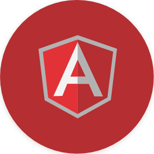

# generator-angular-webpack-es6

[](https://www.npmjs.com/package/generator-angular-webpack-es6)
[](https://www.npmjs.com/package/generator-angular-webpack-es6)



> Yeoman generator for AngularJS + Webpack with ES6 and SASS.

> * Perfectly compatible with angularOcLazyLoad plugin
> * SASS as CSS preprocessor
> * Angular UI router as default router already included
> * Optional installation bootstrap-sass source
> * Optional angular modules installation
> * All necessary webpack loaders already included (Sass, Images, Fonts, ngAnnotate, ngTemplateCache, etc.)
> * Config has options for development and production mode

> Use only webpack with npm. No external dependencies like bower, grunt, gulp...

### Install

##### Install required tools `yo`, and `webpack`:
```
npm install -g yo webpack
```

##### Install `generator-angular-webpack-es6`:
```
npm install -g generator-angular-webpack-es6
```

### Directory Layout

```shell

├── /config/                              # Build config
│   └── /webpack/                         # Webpack config files
│   	├── /environments/                # Webpack env dependent configs
│   	└── global.js                     # Global webpack settings for all envs
├── /dist/                                # The folder for compiled output
├── /node_modules/                        # 3rd-party libraries and utilities
├── /src/                                 # Source folder
│   ├── /app/                             # Application code
│   │	├── /components/                  # Shared UI components
│   │	│	└── /footer/                  # Footer shared component. Place footer's styles, directives, templates here
│   │	├── /core/                        # Shared angular services/directives
│   │	│	├── /directives/              # Shared directives
│   │	│	├── /services/                # Shared services
│   │	│	└── /core.module.js           # Import of all core components should be here
│   │	├── /pages/                       # All pages-dependent content should place here
│   │	│	├── /main/                    # Main page
│   │	│	│	├── /main.controller.js   # Main page Controller
│   │	│	│	├── /main.html            # Main page template
│   │	│	│	├── /main.module.js       # Main page module
│   │	│	│	├── /main.route.js        # Main page routes
│   │   │   └── /.../                     # Other pages...
│   │	├── /index.bootstrap.js           # Entry point. Import internal and external modules and bootstrap (RUN) angular application
│   │	├── /index.components.js          # Define all your custom components here
│   │	├── /index.config.js              # Function that will be triggered in Angular's "config" phase
│   │	├── /index.module.js              # Main application's module
│   │	├── /index.routes.js              # Describe only "otherwise" and async routes here
│   │	├── /index.run.js                 # Function that will be triggered in Angular's "run" phase
│   │	├── /index.vendor.js              # Import all vendors and 3rd party plugins here
│   ├── /assets/                          # Static content
│   │	├── /images/                      # Images
│   │	├── /js/                          # Extra libs folder
│   │	└── /styles/                      # Styles folder
│   │		├── /css/                     # CSS
│   │		└── /sass/  		          # SASS
│   ├── favicon.ico                       # Application icon to be displayed in bookmarks
│   └── tpl-index.html                    # Template for html-webpack-plugin that will be transpiled into index.html in /dist
│── .babelrc                              # Babel config with presets and plugins
│── .gitignore                            # List of files to ignore by git
│── package.json                          # The list of project dependencies and NPM scripts
└── webpack.config.js                     # Bundling and optimization settings for Webpack
```

### Run

##### Create a new directory, and go into:
```
mkdir my-new-project && cd $_
```

##### Run `yo angular-webpack-es6`, and select desired technologies:
```
yo angular-webpack-es6
```

##### Run `npm run dev` to start development server on http://localhost:8080:
```
npm run dev
```

##### To make production-ready build run `npm run build` after few moments you will see build id `dist` folder:
```
npm run build
```

### Contribute

##### If you want to contribute:
> * Fork repository and clone project to your machine
> * Install npm packages and create new feature/fix branch
> * Link local project to be able install generator with `yo` from folder like from global installed package:
> ``` npm link ```
> * Make PR
> * ...
> * PROFIT

#### TODO:
> * ~~Add better examples with lazy-loaded modules~~ Added in 0.1.2
> * ~~Update to Babel6~~ Added in 0.2.0

#### Inspired by [generator-gulp-angular](https://github.com/Swiip/generator-gulp-angular) project.